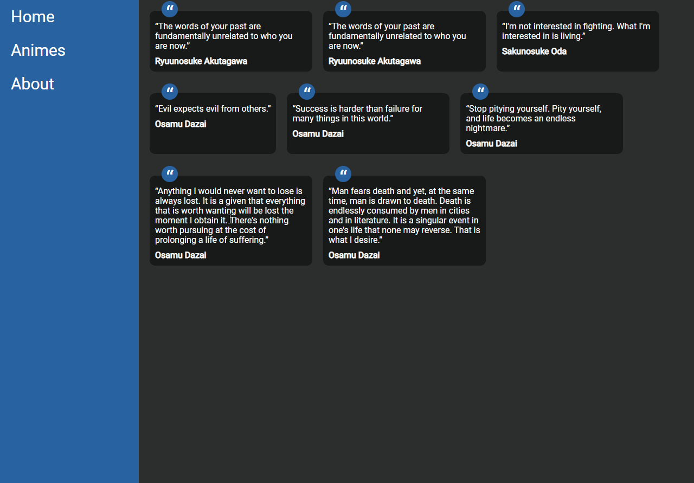

<p align="center">
  
</p>

<p align="center"> 
  
     
  <a href="https://github.com/gleisonkz">
    
  </a>  
     
     
  
</p>

<p align="center">
 <a href="#eye_speech_bubble-visualizar">Visualizar</a> •
 <a href="#information_source-sobre">Sobre</a> •
 <a href="#arrow_forward-executar">Executar</a> •
 <a href="#hammer_and_wrench-tecnologias">Tecnologias</a> • 
 <a href="#brain-conceitos-aplicados">Conceitos</a> •
 <a href="#sparkles-funcionalidades">Funcionalidades</a> •
 <a href="#boy-autor">Autor</a> •
 <a href="#balance_scale-licença">Licença</a>
</p>

---

## :eye_speech_bubble: **Visualizar**

<div align="center">

Deploy efetuado no [Netlify](https://www.netlify.com/) para visualizar: [Clique Aqui](https://https://vanilla-ts-spa.netlify.app/)

|                         :computer:Preview 1                         |                        :computer: Preview 2                         |
| :-----------------------------------------------------------------: | :-----------------------------------------------------------------: |
| <kbd></kbd> | <kbd></kbd> |

</div>
  
---

## :information_source: Sobre

<div align="center">

Projeto de demonstração de um SPA feito com o Vanilla TS. Utilizando apenas parcel e typescript.

Toda a parte de roteamento foi feita do 0 sem utilização de frameworks.

As páginas também realizam o consumo da api Animechan para obter os dados dos animes.

E listar citações de cada personagem de um determinado anime na página de detalhes.

---

</div>

## :arrow_forward: **Executar**

<div align="center">

Para executar esse projeto você precisa baixar este repositório, ter o Gerenciador de Pacotes do Node ([`NPM`](https://www.npmjs.com/get-npm)) ou o Gerenciador de Pacotes YARN ([`YARN`](https://yarnpkg.com/getting-started)) instalado.

Abra o prompt de comando no diretório do projeto na pasta <code>vanilla-ts-spa-path-location</code>, e execute os seguintes códigos:

<details>
  <summary><i>com <b>npm</b></i></summary>
  
  ```bash
  # Instalar dependências
  $ npm install ou npm i

# Iniciar o servidor de desenvolvimento

$ npm start

````

</details>

<details>
<summary><i>com <b>yarn</b></i></summary>

```bash
# Instalar dependências
$ yarn install

# Iniciar o servidor de desenvolvimento
$ yarn start

````

</details>

> ⚠️ O servidor de desenvolvimento será iniciado na porta: 1234 - Acesse <http://localhost:1234>

</div>

---

## :hammer_and_wrench: **Tecnologias**

<div align="center">

|                    :globe_with_meridians: FrontEnd                    |
| :-------------------------------------------------------------------: |
|      [HTML 5](https://developer.mozilla.org/en-US/docs/Web/HTML)      |
|       [CSS 3](https://developer.mozilla.org/en-US/docs/Web/CSS)       |
| [JavaScript](https://developer.mozilla.org/en-US/docs/Web/JavaScript) |
|                    [Parcel](https://parceljs.org/)                    |
|                    [Node](https://nodejs.org/en/)                     |

</div>

---

## :brain: **Conceitos Aplicados**

<div align="center">

|        :page_facing_up:        |
| :----------------------------: |
|         CSS Variables          |
|          ES6 Modules           |
|           fetch API            |
|          Async Await           |
| Fake Cache Using Local Storage |
|          Mapped Types          |
|        Index Signatures        |
|       Singleton Pattern        |
|    Template Method Pattern     |
|          History API           |
|     Path Location Routing      |

</div>

---

## :sparkles: **Funcionalidades**

<div align="center">

|        :page_facing_up:        |
| :----------------------------: |
|       Listagem de Animes       |
| Listagem de Citações por Anime |

</div>

---

## :boy: **Autor**

<div align="center">

<a href="https://github.com/gleisonkz">
 
 <br/>
 <sub><b>Gleison de Almeida</b></sub>
</a>

Desenvolvido com ❤️ por Gleison Almeida 👋🏽 Meus Contatos!

[](https://www.linkedin.com/in/gleison-ribeiro-a65257119)
[](https://github.com/gleisonkz)
[](mailto:gleisonsubzerokz@gmail.com)

</div>

---

## :balance_scale: **Licença**

<div align="center">

Copyright © 2021 [Gleison Almeida](https://github.com/gleisonkz).<br />
This project is licensed by [MIT](./LICENSE).

</div>
